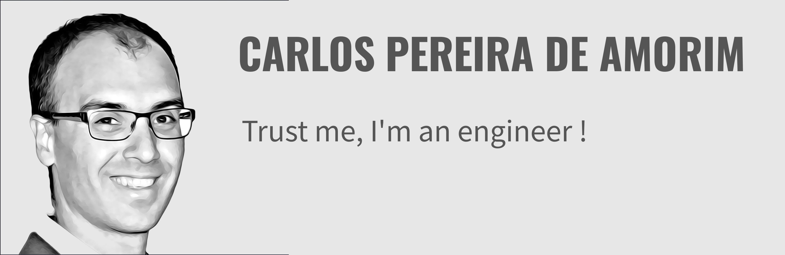

### Hello 👋 moi c'est Carlos 👨‍💻

Je suis ingénieur en informatique, spécialisé dans le développement d'applications web sur-mesure avec PHP/Symfony.

## Mes compétences

Concrétement, mes principales compétences sont sur :  
- Alignement des objectifs techniques sur les objectifs produits
- Management et recrutement d'équipe
- Mise en place de l'agilité
- Développement d'API Rest
- Développement d'applications avec PHP/Symfony/APi Platform
- Conception de PoC et MVP
- Audit technique

## Rôles dans l'équipe

Selon les missions, j'ai le rôle de :
- développeur PHP/Symfony
- lead dev
- CTO
- Product Owner

## Mes Activités

* Je donne des formations autour de l'agilité, de la POO, de git et du PHP/Symfony [#LearnEveryDay](#LearnEveryDay)
* J'essaie de contribuer au framework Symfony [#GiveBack](#GiveBack)
* Je développe des applications sur-mesure en prenant en compte les besoins clients, le budget et la deadline [#Product](#Product)
* Je construis des équipes techniques et les fait monter en compétences, aussi bien techniques que produit [#Nurture](#Nurture)
* Je développe [www.streetchef.me](www.streetchef.me), une app pour localiser les food trucks autour de soi, et permettre aux métiers de bouche de mettre rapidement en place une interface de commande en ligne. Pour en savoir plus -> [www.streetchef.pro](www.streetchef.pro) [#Vision](#Vision)

## En vrac

Techniquement, je suis compétent sur :  

* PHP / Symfony
* API Rest
* RabbitMQ
* Supervisor
* Docker
* Mysql
* MongoDB
* Docker
* et toujours en train de me former

## En savoir plus

 

## Me contacter

N'hésitez pas à m'envoyer un email à [carlos@shauri.fr](mailto:carlos@shauri.fr)

---

<!--
**epitre/epitre** is a ✨ _special_ ✨ repository because its `README.md` (this file) appears on your GitHub profile.

Here are some ideas to get you started:

- 🔭 I’m currently working on ...
- 🌱 I’m currently learning ...
- 👯 I’m looking to collaborate on ...
- 🤔 I’m looking for help with ...
- 💬 Ask me about ...
- 📫 How to reach me: ...
- 😄 Pronouns: ...
- ⚡ Fun fact: ...
-->

